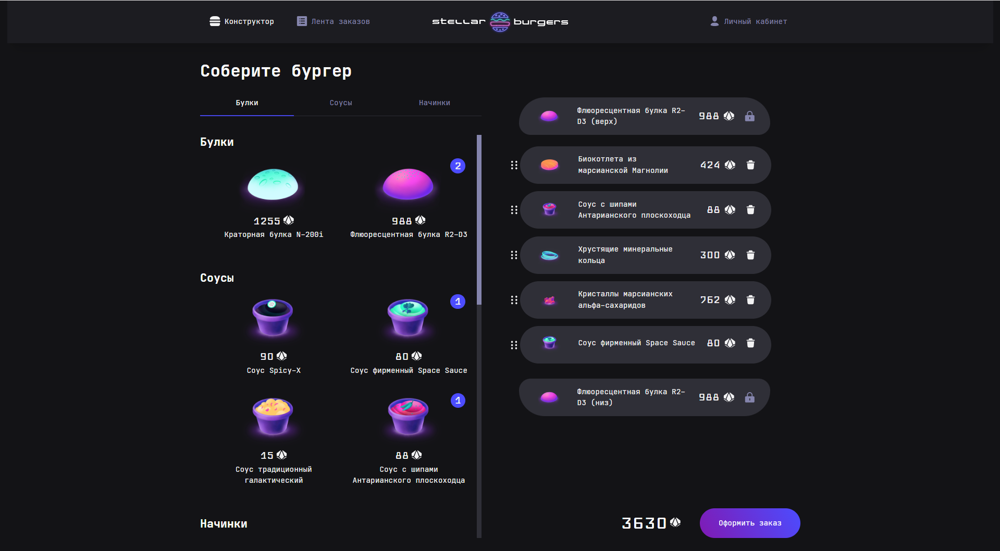

# Stellar Burgers - Космический конструктор бургеров 🚀🍔

React-приложение для заказа космических бургеров с технологиями будущего. Проект включает конструктор бургеров, систему заказов и личный кабинет.



## 🌟 Особенности

- Drag-and-drop конструктор ингредиентов
- Регистрация и авторизация
- История заказов в реальном времени
- Модальные окна

## 🛠 Технологии

**Frontend:**

- React 18
- Redux Toolkit
- TypeScript
- WebSocket (для live-обновлений)
- Cypress (e2e тесты)
- Jest (unit-тесты)

**Backend:**

- REST API
- WebSocket (для заказов)

**Инфраструктура:**

- GitHub

## ⎛⎝ ≽ > ⩊ < ≼ ⎠⎞ Просмотр

[Тыкайте](https://alicetyu.github.io/react-burger/ "там красиво")

## 📦 Установка

Убедитесь, что у вас установлен Node.js v16+ и npm v8+.

```bash
git clone https://github.com/AliceTYu/react-burger.git
cd react-burger
npm install
```

## 🚀 Запуск

```bash
npm run start
```

Откройте http://localhost:3000

## 🧪 Тестирование

**Unit-тесты:**

```bash
npm test
```

**E2E тесты (Cypress):**

```bash
npm run cypress:open  # GUI режим
npm run cypress:run   # Headless режим
```
